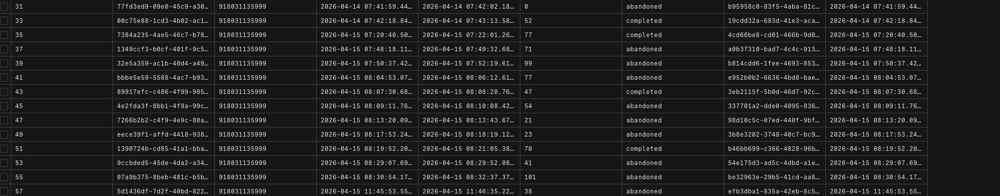
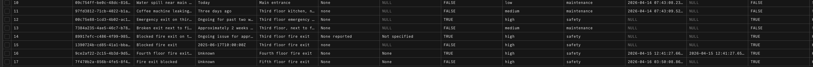
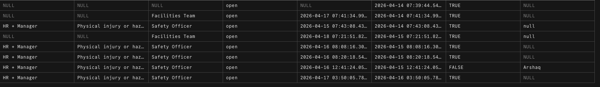
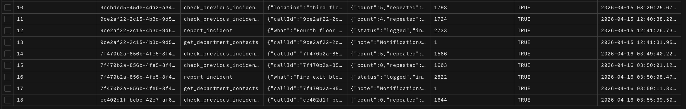
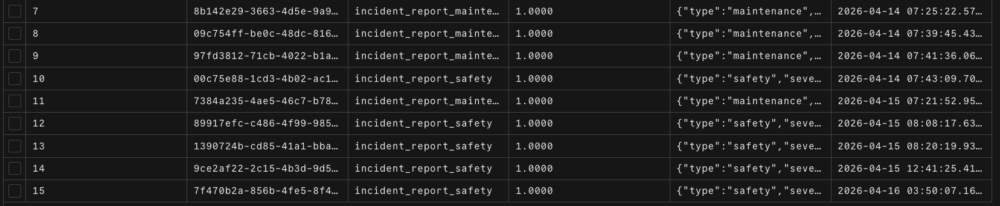
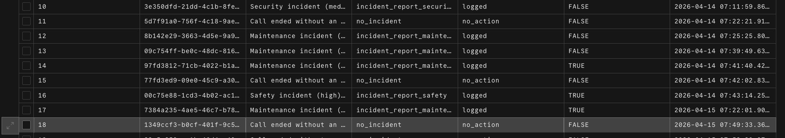
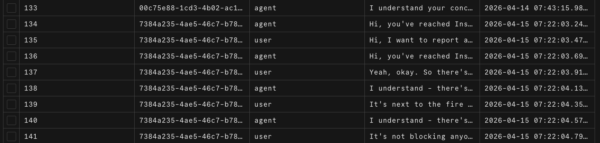

# InspireWorks Incident Reporter

A production-ready voice AI agent for workplace incident reporting. Employees call a phone number, speak to an AI agent, and their incident is logged, categorised, and escalated automatically — no forms, no email chains.

Built with Ultravox (voice AI), Plivo (telephony + SMS), Vercel (serverless), and Neon PostgreSQL.

---

## Demo Video

[](https://www.loom.com/share/a783955605c541fd976fd77b58b4e8ff)

[Watch on Loom](https://www.loom.com/share/a783955605c541fd976fd77b58b4e8ff)

---

## Problem Statement

Employees at InspireWorks often don't report workplace incidents because the process is too slow, too visible, or too intimidating. This agent gives them a confidential, always-available voice channel to report anything from a broken chair to a serious safety hazard — anonymously if they prefer.

See [docs/PROBLEM_STATEMENT.md](docs/PROBLEM_STATEMENT.md) for full details.

---

## Architecture

```
Caller → Plivo (PSTN) → /api/webhook/answer → Ultravox (Voice AI)
                                                      ↓
                                           /api/tools/report-incident
                                                      ↓
                                          Neon PostgreSQL + Plivo SMS
                                                      ↓
                                         Ultravox hangUp → call ends
                                                      ↓
                                    /api/webhook/events → transcript + summary
```

See [docs/ARCHITECTURE.md](docs/ARCHITECTURE.md) for full design decisions.

---

## Features

- **4 incident types** — maintenance, safety, interpersonal, security
- **4 severity levels** — low, medium, high, critical
- **3 custom tools** — `report_incident`, `check_previous_incidents`, `get_department_contacts`
- **Context-aware SMS** — message content adapts to incident type and severity
- **Automatic escalation** — high/critical incidents flagged immediately
- **Follow-up tracking** — assigned to relevant team with due dates based on severity
- **Caller anonymization** — phone numbers never stored
- **Deduplication** — race-safe advisory lock prevents duplicate incidents if AI retries
- **Full logging** — transcripts, tool calls, detected intents, call summaries all stored

---

## Setup

### 1. Clone and install

```bash
git clone https://github.com/arshaqs-woem/incident-reporter
cd incident-reporter
npm install
```

### 2. Environment variables

Copy `.env.example` to `.env` and fill in all values:

```bash
cp .env.example .env
```

See [Environment Variables](#environment-variables) below.

### 3. Set up the database

```bash
node scripts/setup-db.js
```

### 4. Deploy to Vercel

```bash
vercel --prod
```

### 5. Configure Plivo

In the Plivo console, set your phone number's **Answer URL** to:
```
https://your-vercel-url.vercel.app/api/webhook/answer
```
Method: POST

---

## Environment Variables

| Variable | Description |
|----------|-------------|
| `PLIVO_AUTH_ID` | Plivo account Auth ID |
| `PLIVO_AUTH_TOKEN` | Plivo account Auth Token |
| `PLIVO_NUMBER` | Your Plivo phone number (E.164) |
| `ULTRAVOX_API_KEY` | Ultravox API key (primary) |
| `ULTRAVOX_API_KEY_BACKUP` | Ultravox API key (fallback on 401/402/403) |
| `DATABASE_URL` | Neon PostgreSQL connection string |
| `HR_PHONE` | Phone number to receive HR SMS alerts |
| `MANAGER_PHONE` | Phone number to receive manager SMS alerts |
| `PUBLIC_URL` | Your Vercel deployment URL (no trailing slash) |

---

## API Endpoints

| Method | Endpoint | Description |
|--------|----------|-------------|
| POST | `/api/webhook/answer` | Plivo answer webhook |
| POST | `/api/webhook/events` | Plivo hangup webhook |
| POST | `/api/tools/report-incident` | Log incident + send SMS |
| POST | `/api/tools/check-previous-incidents` | Look up prior incidents |
| GET | `/api/calls` | List all calls |
| GET | `/api/calls/:id` | Get call detail |
| GET | `/api/calls/:id/summary` | Get call summary |
| GET | `/api/incidents` | List incidents with follow-ups |
| GET | `/api/follow-ups` | List follow-ups |
| GET | `/api/analytics` | Call and incident analytics |
| GET | `/api/health` | Health check |

See [docs/API.md](docs/API.md) for full request/response documentation.

---

## Database Screenshots

### call_logs
Every inbound call gets a row — recording call ID, start/end timestamps, duration in seconds, and status (`completed` or `abandoned` if no incident was logged).



---

### incidents (core fields)
The primary table. Stores what happened, where, severity level, incident type, and whether the reporter chose to stay anonymous.



---

### incidents (escalation & follow-up)
The same table scrolled right — shows which team was assigned, follow-up status, due date (calculated from severity), and whether the incident was escalated.



---

### tool_calls
Every tool the AI invoked is logged here with full input/output JSON, execution time in ms, and success status. All three tools visible: `check_previous_incidents`, `report_incident`, `get_department_contacts`.



---

### detected_intents
Intent classification logged per call — intent name, confidence score (1.0000 = high confidence), and extracted entities as JSON.



---

### call_summaries
Ultravox generates a natural language summary after each call. Resolution status (`logged` or `no_action`) and whether follow-up is required are stored here.



---

### transcripts
Full turn-by-turn conversation stored per call — speaker (`agent` or `user`), message text, and timestamp. Useful for auditing and review.



---

## Known Limitations

- **Call-to-incident linkage** depends on "most recent active call" — works for sequential demo use but would need a proper fix for concurrent production traffic (Ultravox does not send call ID in HTTP tool headers)
- **Transcripts** are fetched from Ultravox after hangup — there is a short delay before they appear in the DB
- **Transcript storage is raw turn-by-turn data** — good for auditing and analytics, but less readable than a single stitched conversation view
- **Caller anonymization** is implicit — phone numbers are never stored anywhere in the system

---

## Future Improvements

- Web dashboard for HR to view and manage incidents
- Multi-language support via Ultravox language settings
- Proper call-ID injection once Ultravox supports it in tool headers
- Slack/email notifications in addition to SMS
- Caller callback option for follow-up

---

## Tech Stack

- [Ultravox](https://ultravox.ai) — Speech-native voice AI
- [Plivo](https://plivo.com) — Telephony and SMS
- [Vercel](https://vercel.com) — Serverless deployment
- [Neon](https://neon.tech) — Serverless PostgreSQL
